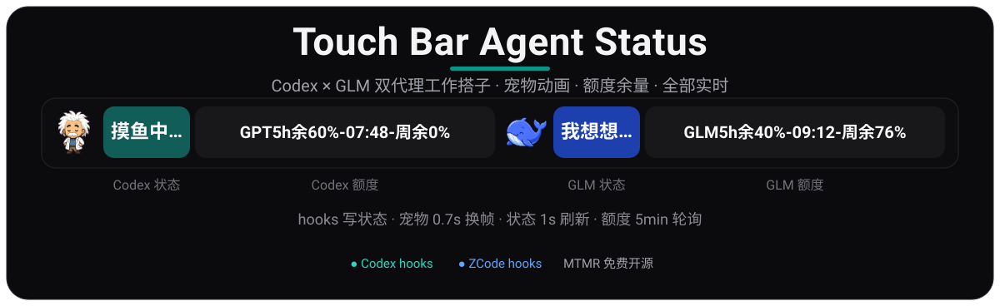
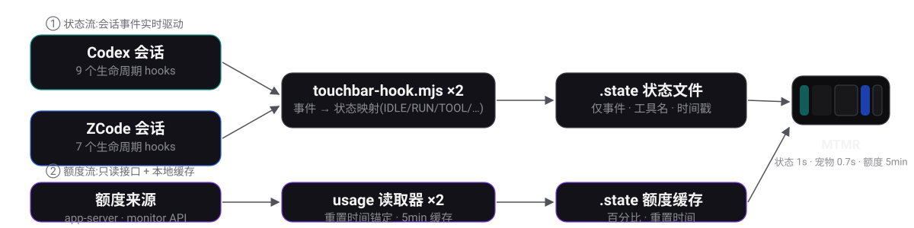

<div align="center">

</div>

# Touch Bar Agent Status

<p align="center">
<a href="README.md">简体中文</a> · <b>English</b> · <b>Fork</b> from <a href="https://github.com/PPPHUANG/touch-bar-agent-status">PPPHUANG/touch-bar-agent-status</a>
</p>

> [!NOTE]
> **This project is a fork of [PPPHUANG/touch-bar-agent-status](https://github.com/PPPHUANG/touch-bar-agent-status).**
> The original project is a Touch Bar status light for Codex (Einstein pet + status slots) — all credit to the original author for the idea and implementation.
> This fork adds **ZCode (GLM) dual-agent support**: a DeepSeek pet, a GLM status slot, a GLM quota slot, and reset-time displays on both quota slots. See [Differences from upstream](#differences-from-upstream) for the full list.

Turn your MacBook's Touch Bar into a status light for AI coding agents: **Codex** and **ZCode (GLM)** each get a "pet + status text + quota" combo, so you can tell at a glance who is slacking off, who is running commands, who is waiting for your approval, and how much quota is left.

## What it does

- 🚦 **Live status light** — session lifecycle hooks drive the display in real time: thinking, running commands, editing files, waiting for approval, done — every state switches within seconds.
- 🐬 **Two pet buddies** — Einstein follows Codex, DeepSeek follows GLM; they stroll, sprint, or sulk on the Touch Bar at 0.7s per frame.
- 📊 **Dual quota slots** — GPT's 5-hour/weekly windows and GLM's 5-hour/weekly credits each show remaining percentage and reset time.
- 🔒 **Privacy friendly** — state files only store event names, tool names, and timestamps; quota caches only store percentages and timestamps. No prompts or responses are saved, and API keys are read from local config at runtime, never committed.

## Real screenshots

All images below are real Touch Bar captures (the Einstein icon inside the slot is from an earlier single-slot design; pets are now standalone slots — the status visuals are unchanged):

**Thinking** — blue state + elapsed time:


**Running a command** — terminal icon + tool name + elapsed time:


**Editing files** — patch line counts (`xxx.mjs +3 -0` for one file, `3 files +24 -6` for many):


**Waiting for approval** — purple permission state, falls back to idle after 90s:


**Slacking off** — the perfectly reasonable idle state:


<details>
<summary>More screenshots (browsing, done states, etc.)</summary>


</details>

## How it works

<div align="center">

</div>

Two data flows, both read-only and fully local:

1. **Status flow** — agent sessions fire lifecycle hooks (9 events for Codex, 7 for ZCode); the hook script writes the current state to `.state/*-touchbar-status.json`. MTMR slots render the status text every second; pets switch frames every 0.7s.
2. **Quota flow** — GPT quota comes from the local Codex `app-server` (read-only `account/rateLimits/read`), GLM quota from BigModel's `quota/limit` monitor endpoint, each with a 5-minute cache. Details in [docs/zcode-usage-api.md](docs/zcode-usage-api.md).

## Status reference

Both agents share the same state machine and copy:

| Touch Bar shows | State | Trigger |
|---|---|---|
| 摸鱼中… (slacking) | IDLE | No session or state expired, looping dots |
| 接上回合 / 开工了 (back at it / starting) | RUN | Session start (SessionStart), shown for 4s |
| 我想想… (let me think) | RUN | Prompt submitted, model thinking, between tool calls |
| 跑个命令 (running a command) | TOOL | Bash executing, elapsed time after 10s |
| 改两笔 / `file +N -M` (tweaking) | TOOL | Edit/Write/patch executing |
| 去看一眼 (taking a look) | TOOL | Browser / search / MCP tools |
| 喊同事 (delegating) | TOOL | Subagents (Agent/Task) |
| 忙一下 (busy) | TOOL | Fallback for other tools |
| 刚做完 (just finished) | RUN | A tool completed, flashes 3s |
| 碰了个钉子 (hit a snag) | RUN | A tool failed, flashes 3s |
| 等你点头 (waiting for you) | WAIT | Permission request, kept up to 90s |
| 收工啦 (done for now) | OK | Turn ended, shown for 20s |
| 有点卡住 (a bit stuck) | ERR | Hook itself failed (should not appear in normal use) |

Pet row mapping: IDLE → walk (row 0), RUN → run (row 7), TOOL → work (row 1), WAIT → look around (row 6), OK → wave (row 3), ERR → sad (row 5).

## Quick start

### 0. Requirements

- macOS + a MacBook with a Touch Bar, and the free [MTMR](https://github.com/Toxblh/MTMR):
  ```sh
  brew install --cask mtmr
  ```
- [ChatGPT.app](https://chatgpt.com/download) (bundles the Codex CLI and a Node runtime, expected at `/Applications/ChatGPT.app`; installers fall back to node from PATH if missing).
- For the GLM status light / quota slot: install and sign in to [ZCode](https://zcode.z.ai) with a personal (coding) plan. Skip if you only want the Codex light.

### 1. Clone and install

```sh
git clone https://github.com/zj-linjie/lin-touchbar-status.git
cd lin-touchbar-status

NODE="/Applications/ChatGPT.app/Contents/Resources/cua_node/bin/node"

"$NODE" install-codex-hooks.mjs          # Codex status hooks
"$NODE" install-zcode-hooks.mjs          # GLM status hooks (optional)
"$NODE" scripts/generate-mtmr-config.mjs # generate the 6-slot MTMR config
killall MTMR; open -a MTMR               # restart MTMR
```

### 2. Trust the hooks

- **Codex**: run `codex`, type `/hooks`, review and choose `Trust all and continue` (re-trust after script updates is normal).
- **ZCode**: configuration-file hooks need no trust step — **just open a new ZCode session** (hook config is snapshotted when a session starts).

### 3. Verify

```sh
"$NODE" codex-touchbar-read.mjs --text   # prints 摸鱼中...
"$NODE" zcode-touchbar-read.mjs --text   # prints 摸鱼中...
"$NODE" codex-usage-read.mjs             # prints GPT5h余100%-08:28-周余0%
"$NODE" zcode-usage-read.mjs             # prints GLM5h余100%-08:28-周余76%
```

Then run one real task in Codex and in ZCode — the Touch Bar should walk through 我想想 → 跑个命令 → 收工啦 → 摸鱼中 while the pets change poses.

## Slot layout

`scripts/generate-mtmr-config.mjs` generates these 6 slots (to change the layout, edit that script and regenerate):

| # | Slot | Implementation | Width | Refresh |
|---|---|---|---|---|
| 1 | Einstein pet (follows Codex) | `mtmr-pet.applescript` | 24 | 0.7s |
| 2 | Codex status | `codex-touchbar-read.mjs --text` | 76 | 1s |
| 3 | GPT quota | `codex-usage-read.mjs` | 260 | 5min |
| 4 | DeepSeek pet (follows GLM) | `mtmr-pet-deepseek.applescript` | 24 | 0.7s |
| 5 | GLM status | `zcode-touchbar-read.mjs --text` | 76 | 1s |
| 6 | GLM quota | `zcode-usage-read.mjs` | 260 | 5min |

## Quota details

Neither API hands back a fixed reset time, so a little client-side handling is needed:

- **GPT (Codex)**: `resetsAt` always equals "read time + 5 hours" (a rolling window). Displaying it verbatim would keep it 5 hours away forever, so the reader anchors the window end on first observation, counts down stably, and re-anchors after it lapses.
- **GLM (ZCode)**: BigModel only returns `nextResetTime` while the 5-hour window holds unreturned consumption (rolling, follows the latest request). When present it is shown verbatim (matches the app's usage page); at 100% remaining an "observed time + 5h" placeholder anchor is displayed and switches to the real value once consumption starts.
- Concurrent sessions share one state/cache file, last writer wins; a `~` prefix means the API failed and stale cached data is being shown.

## Pets

- Pet frames come from each agent's bundled spritesheet (9 rows × 6-8 frames), cropped by `scripts/extract-mtmr-pet-frames.sh` into `assets/pet/<name>/`.
- Pet slots decouple art from data via two env vars: `MTMR_PET_PREFIX` picks the art (einstein / deepseek), `MTMR_PET_READER` picks which agent's session state to follow (defaults to Codex; GLM uses `zcode-touchbar-read.mjs`).
- Adding a new pet: feed its spritesheet to the extraction script, drop the frames into `assets/pet/<name>/`, and register it in `scripts/generate-mtmr-config.mjs`.

## Advanced: one reader, many slots

`codex-touchbar-read.mjs` and `zcode-touchbar-read.mjs` support per-slot output for free-form MTMR layouts:

| Flag | Shows |
|---|---|
| `--text` (default main state) | `我想想...` / `跑个命令` / `摸鱼中...` |
| `--slot timer --text` | Current turn elapsed time, e.g. `00:18` |
| `--slot tool --text` | Current tool: `Bash` / `Patch` / `Browser` |
| `--slot diff --text` | Patch lines `+12 -3` (`diff-add` / `diff-remove` split them) |
| `--slot file --text` | Current file name |
| `--slot pet --text` | Pet icon only |
| `--meta-json` | Debug: state, colors and SF Symbol as JSON |

See `codex-touchbar-read.mjs` for full slot behavior. The approval hold duration is tunable via `CODEX_TOUCHBAR_WAIT_STALE_MS` (default 90s).

## Files

| File | Purpose |
|---|---|
| `codex-touchbar-hook.mjs` | Codex hooks writer (shared state machine, reused by ZCode) |
| `zcode-touchbar-hook.mjs` | ZCode hooks bridge (separate state file) |
| `codex-touchbar-read.mjs` | Codex status reader (status text / pet row / slots) |
| `zcode-touchbar-read.mjs` | GLM status reader (same, reads the ZCode state file) |
| `codex-usage-read.mjs` | GPT quota reader (local Codex app-server) |
| `zcode-usage-read.mjs` | GLM quota reader (BigModel monitor API) |
| `install-codex-hooks.mjs` / `install-zcode-hooks.mjs` | Merge hooks into `~/.codex/hooks.json` / `~/.zcode/cli/config.json` (with backups) |
| `mtmr-pet-read.mjs` | State → pet frame selector (`MTMR_PET_PREFIX` / `MTMR_PET_READER`) |
| `mtmr-pet.applescript` / `mtmr-pet-deepseek.applescript` | MTMR pet slot scripts |
| `scripts/generate-mtmr-config.mjs` | Generates MTMR `items.json` (source of truth for the layout) |
| `scripts/extract-mtmr-pet-frames.sh` etc. | Crop pet frames from spritesheets |
| `assets/pet/einstein|deepseek/*.png` | Pet frame assets |
| `assets/readme/*` | README hero, diagrams and real screenshots |
| `docs/zcode-usage-api.md` | GLM quota endpoint, fields and gotchas |
| `.state/*.json` | Runtime state and caches (generated, not committed) |

## Differences from upstream

| Upstream ([PPPHUANG/touch-bar-agent-status](https://github.com/PPPHUANG/touch-bar-agent-status)) | This fork adds |
|---|---|
| Codex status light (9 hooks) | ZCode (GLM) status light (7 hooks, `install-zcode-hooks.mjs`) |
| Einstein pet following Codex | DeepSeek pet independently following GLM |
| Codex quota slot | GLM quota slot (`zcode-usage-read.mjs`) |
| Hand-edited MTMR config | `generate-mtmr-config.mjs` one-command 6-slot layout |
| — | State machine additions: `PostToolUseFailure` (hit a snag), subagent detection (delegating), auto-idle after the session greeting |
| — | Quota reset-time display with anchoring (both slots) |
| — | Bilingual README (中文 / English) |

## Credits

- Thanks to **[PPPHUANG](https://github.com/PPPHUANG)** for the original [touch-bar-agent-status](https://github.com/PPPHUANG/touch-bar-agent-status) — the "AI work buddy status light" idea, the Codex hooks architecture, the Einstein pet, and the entire status visual language come from upstream. This fork just stood on its shoulders and built a home for GLM too.
- Pet pixel art ships from the Codex (Einstein) and DeepSeek (whale) apps; copyright belongs to their respective owners.
- [MTMR](https://github.com/Toxblh/MTMR) — the open-source project that gives the Touch Bar a second life.
